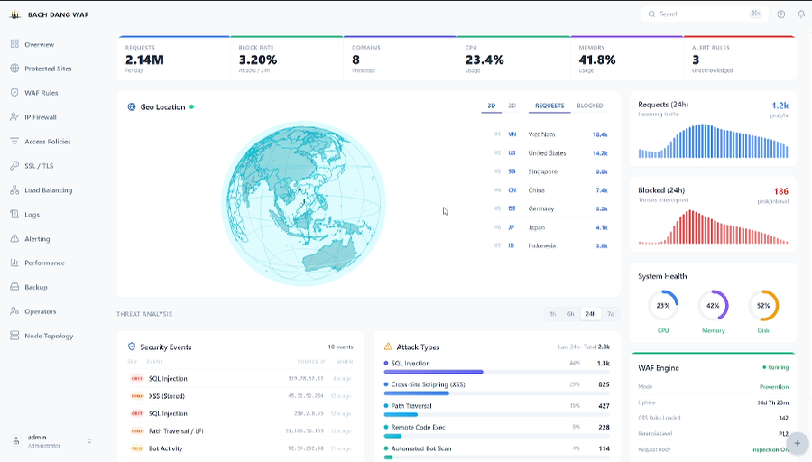

<div align="center">


<h1>BACH DANG WAF</h1>

**Self-hosted Web Application Firewall management console**  
*Nginx · ModSecurity · OWASP CRS · Zero vendor lock-in*

[](LICENSE)
[](https://github.com/huynhtrungcsc/bach-dang-waf/releases)
[](https://nodejs.org/)
[](https://www.typescriptlang.org/)
[](https://www.postgresql.org/)
[](CONTRIBUTING.md)

[Quick Start](#quick-start) · [Features](#features) · [Architecture](#architecture) · [Configuration](#configuration) · [Issues](https://github.com/huynhtrungcsc/bach-dang-waf/issues)

</div>

---

> Named after the Battle of Bạch Đằng, where Vietnamese forces repelled foreign naval invasions three times across history. Bach Dang WAF stands as the perimeter guard for your web infrastructure.

---

> **Project Status — Lab and Learning Environments**
>
> **EN:** This project is functional and deployable, but has not yet undergone a full security audit for production use. Security hardening is ongoing. An announcement will be made when it meets production-grade standards.  
> Recommended use: lab environments, student projects, internal test systems. If deployed on a live system, perform your own security assessment before going to production.
>
> **VI:** Dự án hoạt động và có thể triển khai, nhưng chưa được kiểm thử bảo mật đầy đủ cho production. Đang tiếp tục phát triển và bổ sung các biện pháp bảo mật.  
> Khuyến nghị: dùng cho lab, bài tập, môi trường thử nghiệm nội bộ. Nếu triển khai thực tế, hãy tự đánh giá bảo mật trước khi đưa vào production.

---



---

## What is Bach Dang WAF?

Bach Dang WAF is a **self-hosted management console** for Nginx and ModSecurity. It replaces SSH-based config editing with a clean web interface: manage domains, SSL certificates, IP access policies, ModSecurity rules, alerting thresholds, and cluster replica nodes — all from one place.

Built for:

- **Labs and education** — learn WAF, Nginx, and ModSecurity with a real management UI
- **DevOps / SRE teams** — visual management layer over existing Nginx infrastructure
- **Security engineers** — fine-grained ModSecurity rule control without SaaS pricing
- **VMware and homelab** — enterprise-grade WAF at zero licensing cost
- **On-premises deployments** — fully self-hosted, no telemetry, no external dependencies

---

## Features

### Traffic Protection

- WAF event log with severity classification: PASS / ALERT / BLOCK
- IP Firewall — allow/deny lists with CIDR support and JSON import/export
- ModSecurity integration with OWASP CRS, per-rule enable/disable, custom rule editor

### Infrastructure

- Domain management with upstream server configuration
- SSL/TLS — manual upload, Let's Encrypt ACME, auto-renewal tracking
- Load balancer upstream pools with health check monitoring
- Replica node management — sync config from controller to replica WAF nodes

### Observability

- Real-time dashboard: requests/sec, bandwidth, error rate, threat events, geo map
- Performance metrics: CPU, memory, disk, connection pool, nginx worker stats
- Alerting engine with configurable rules, thresholds, and severity levels
- Backup and restore with scheduled configuration snapshots
- Audit log with full operator action history

### Access Control

| Role | Permissions |
|------|-------------|
| Admin | Full access: system config, user management, all WAF controls |
| Operator | WAF management, domains, alerting — no user management |
| Observer | Read-only: dashboards, logs, metrics |

Authentication: JWT access + refresh tokens, bcrypt, TOTP-based 2FA

---

## Architecture

```
┌───────────────────────────────────────────────────────┐
│                  Browser / Operator                    │
└────────────────────────┬──────────────────────────────┘
                         │ HTTP :8080
┌────────────────────────▼──────────────────────────────┐
│           Nginx – Management Console                   │
│     Serves React SPA  +  proxies /api → :3001          │
└───────────────┬───────────────────────────────────────┘
                │ :3001 (internal only)
┌───────────────▼──────────────┐  ┌─────────────────────┐
│   Express + Prisma API        │  │ Nginx + ModSecurity  │
│   Auth, WAF mgmt, Alerting    │  │ Traffic proxy :80/443│
└───────────────┬───────────────┘  └─────────────────────┘
                │
┌───────────────▼───────────────┐
│         PostgreSQL 16          │
└───────────────────────────────┘
```

Design principles:

- The management console (`:8080`) and WAF proxy (`:80`/`:443`) are isolated processes. A console misconfiguration cannot disrupt live traffic.
- All API calls use relative `/api` paths — no IP is hardcoded in the build. Works on any address without rebuilding.
- The backend API is never exposed to the internet. Nginx proxies `/api` internally.

---

## Quick Start

### One-liner (Ubuntu 22.04 / 24.04)

```bash
curl -fsSL https://raw.githubusercontent.com/huynhtrungcsc/bach-dang-waf/main/scripts/deploy.sh | sudo bash
```

Installs Nginx + ModSecurity (compiled from source), PostgreSQL, Node.js 22, systemd services, and UFW rules.

---

### Option A — Docker Compose

**Requirements:** Docker 24+, Compose v2

```bash
git clone https://github.com/huynhtrungcsc/bach-dang-waf.git
cd bach-dang-waf
cp .env.example .env        # Edit DB credentials and secrets
docker compose up -d
```

Open `http://<server-ip>:8080`

| Username | Password | Role |
|----------|----------|------|
| `admin` | `admin123` | Admin |
| `operator` | `operator123` | Operator |
| `viewer` | `viewer123` | Observer |

Change all default passwords immediately after first login.

---

### Option B — Bare Metal

```bash
git clone https://github.com/huynhtrungcsc/bach-dang-waf.git
cd bach-dang-waf
sudo bash scripts/deploy.sh
```

Configures: Node.js 22, pnpm, PostgreSQL (Docker), Nginx 1.28 + ModSecurity 3.x from source, systemd services, UFW (ports 22, 80, 443, 8080).

---

### Option C — Development

```bash
git clone https://github.com/huynhtrungcsc/bach-dang-waf.git
cd bach-dang-waf
cp .env.example .env
pnpm install
pnpm --filter @bach-dang-waf/api db:generate
pnpm --filter @bach-dang-waf/api db:push
pnpm --filter @bach-dang-waf/api db:seed
pnpm dev
```

| Service | URL |
|---------|-----|
| Frontend | `http://localhost:5000` |
| Backend API | `http://localhost:3001` |

The Vite dev server proxies `/api` requests to the backend automatically.

---

## Updating

### Docker Compose

```bash
cd /opt/bach-dang-waf
git pull origin main
docker compose up -d --build
```

### Bare Metal (systemd)

```bash
cd /opt/bach-dang-waf
sudo bash scripts/update.sh
```

Or manually:

```bash
git pull origin main
pnpm install
pnpm --filter @bach-dang-waf/api db:generate
pnpm --filter @bach-dang-waf/api db:deploy
pnpm --filter @bach-dang-waf/web build
sudo systemctl restart bach-dang-waf-backend bach-dang-waf-frontend
```

---

## Configuration

Copy `.env.example` to `.env` and set the required values:

| Variable | Required | Description |
|----------|----------|-------------|
| `DATABASE_URL` | Yes | PostgreSQL connection string |
| `JWT_ACCESS_SECRET` | Yes | Signing key — generate with `openssl rand -hex 48` |
| `JWT_REFRESH_SECRET` | Yes | Refresh key |
| `SESSION_SECRET` | Yes | Session encryption key |
| `CORS_ORIGIN` | No | Comma-separated allowed origins |
| `BCRYPT_ROUNDS` | No | Default 12 |
| `TOTP_ISSUER` | No | App name shown in authenticator apps |
| `NODE_ENV` | No | `development` or `production` |

`VITE_API_URL` is not required — the frontend uses relative `/api` paths.

---

## Firewall

```bash
ufw allow 22/tcp    # SSH — always allow first
ufw allow 80/tcp    # HTTP — WAF proxy + ACME challenge
ufw allow 443/tcp   # HTTPS — WAF proxy TLS
ufw allow 8080/tcp  # Management console
ufw enable
```

`deploy.sh` configures UFW automatically.

---

## Tech Stack

| Layer | Technology |
|-------|------------|
| Frontend | React 19, TypeScript, Vite 7, TanStack Router, Tailwind CSS 4, shadcn/ui |
| Backend | Node.js 22, Express, TypeScript, Prisma ORM |
| Database | PostgreSQL 16 |
| WAF Engine | Nginx 1.28, ModSecurity 3.x, OWASP Core Rule Set |
| Auth | JWT (access + refresh), bcrypt, TOTP 2FA |
| Deployment | Docker Compose, nginx (SPA + API proxy), systemd |
| Monorepo | Turborepo, pnpm workspaces |

---

## Project Structure

```
bach-dang-waf/
├── apps/
│   ├── api/                    Express backend
│   │   ├── src/domains/        Feature modules (WAF, SSL, alerts, backup…)
│   │   ├── src/config/         Environment configuration
│   │   └── prisma/             Schema, migrations, seed
│   └── web/                    React SPA
│       └── src/
│           ├── components/     UI components
│           ├── routes/         TanStack Router file-based routes
│           └── queries/        TanStack Query hooks
├── config/                     Nginx WAF config templates
├── docker/                     Dockerfiles and nginx console config
├── scripts/
│   ├── deploy.sh               Full bare-metal deployment (Ubuntu)
│   ├── update.sh               In-place update
│   └── quickstart.sh           Quick dev setup
└── docker-compose.yml
```

---

## Roadmap

- [ ] Real-time WebSocket log streaming
- [ ] Let's Encrypt auto-renewal via ACME
- [ ] OWASP CRS rule browser with full-text search
- [ ] Webhook / Telegram / Slack alert delivery
- [ ] LDAP / Active Directory authentication
- [ ] Multi-node replica sync dashboard
- [ ] Dark mode
- [ ] Full security audit for production readiness

---

## Contributing

See [CONTRIBUTING.md](CONTRIBUTING.md). Pull requests are welcome. For major changes, open an issue first.

---

## Security

Report vulnerabilities via [GitHub Security Advisories](https://github.com/huynhtrungcsc/bach-dang-waf/security/advisories/new). Do not open public issues for security findings.

See [SECURITY.md](SECURITY.md) for the full policy and deployment hardening checklist.

---

## License

[MIT](LICENSE) — Copyright 2025–2026 [Huỳnh Chí Trung](https://github.com/huynhtrungcsc)

---

<div align="center">

**Bach Dang WAF** — Own your security perimeter.

[Star on GitHub](https://github.com/huynhtrungcsc/bach-dang-waf) · [Open an Issue](https://github.com/huynhtrungcsc/bach-dang-waf/issues) · [Discussions](https://github.com/huynhtrungcsc/bach-dang-waf/discussions)

</div>
